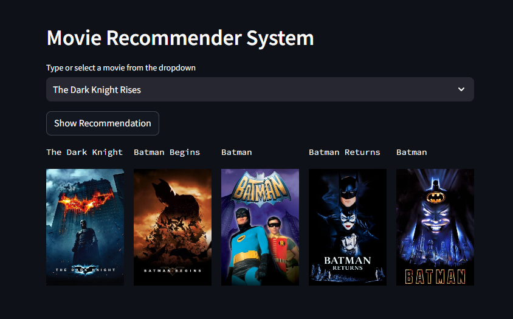

# Movie Recommender System

<p align="center">
  
</p>

This is a **Movie Recommender System** built using Streamlit and the TMDB (The Movie Database) dataset. It allows users to select a movie and get recommendations for similar movies, along with their posters.

This is a **Movie Recommender System** built using Streamlit and the TMDB (The Movie Database) dataset. It allows users to select a movie and get recommendations for similar movies, along with their posters.

## Features

- Select a movie from the dropdown list.
- Get 5 similar movie recommendations based on the selected movie.
- View the posters of the recommended movies.

## Installation

1. Clone this repository to your local machine.
   ```bash
   git clone https://github.com/AhmedEssam29/streamlit_app_movie_recommender.git


- to run the app: streamlit run app.py
